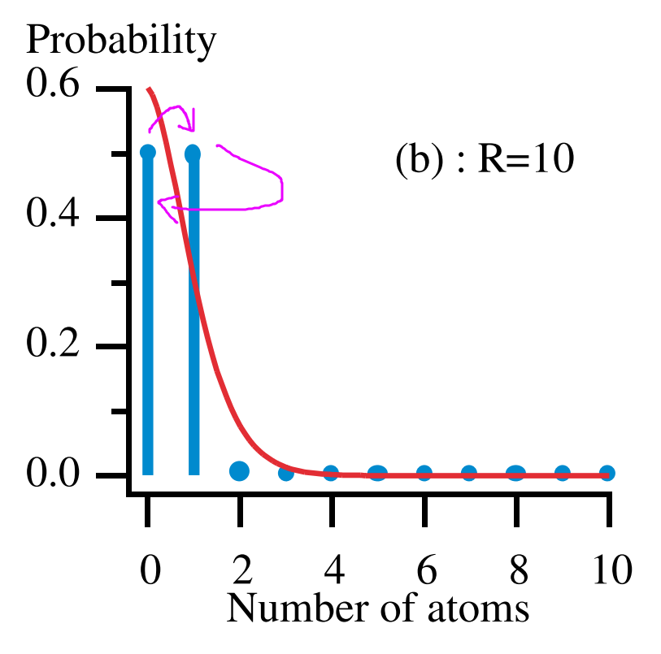
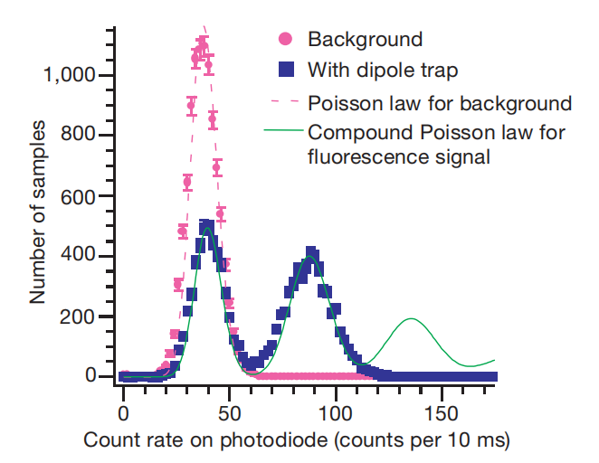
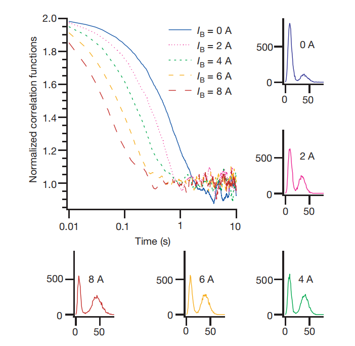

# Paper Notes

> 2022-01-06

## paper list

[Sub-poissonian loading of single atoms in a microscopic dipole trap](../Important_papers/sub-possionian_loading.Schlosser.2001.nature/35082512.pdf)

### abstract

According to collision blockade mechanism shown in above image, loading dipole trap with large enough loading rate will cause a 50-50 loading scheme(generate a $Z_2$ group), and hence break the poisson distribution.

To further show the $Z_2$ property(i.e. 1+1=0), they shown the self-correlation under different loading rate. This work since after the stablized loading percentage achieved, further loading will flip atom number in the trap and cause anti-correlation. The large the loading rate is, the quicker autocorrelation decrease.

Loading rate is adjusted by magnetic field of MOT, which controls atom density in MOT and hence approximately proportional to loading rate.

## interesting content

1. Trapped neutral atoms schemes benifit greatly from the ability to trap and address individual atoms with high spatial resolution.
2. For Stabilized atom loading, life time is dominated by background collision with small loading rate while by the inverse of loading rate with large loading rate.
3. As the CCD camera has a slow response time, an APD is used in parallel

## experiment/representative data

1. Rb
2. typical background collision life time: 2s
3. controlled distance between two trap: 1-10$\mu$m
4. for two atoms separated by 3 mm, the dipole±dipole interaction between Rydberg states creates a level shift larger than 10 MHz.
5. Typically the MOT confines $10^7$ atoms in a 1-mm-diameter cloud, with a density of about $10^10$ atoms $cm^{-3}$ , or 0.01 atoms $\mu m^{-3}$.
6. NA 0.7,  diffraction-limited resolution  0.7 $\mu m$
7. trap wavelength: 810nm (titanium sapphire)
8. temperature: higher than 50$\mu K$