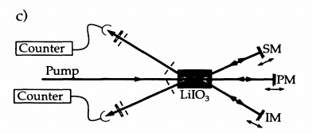

# Paper Notes

> 2022-01-15

## paper list

[Frustrated Two-Photon Creation via Interference](../Important_papers/frustrated_interference.Herzog.1993.PRL)

### abstract

By reflecting both pump, signal and idle, SPDC of incident pump and reflected pump will interfer. Suppression and enhancement are onserverd during such process.

It's obvious that under such setup

$$
I_i = I_s = 2I_0(1-\cos (\phi_i + \phi_s - \phi_p))
$$

($\phi_i + \phi_s - \phi_p$ will be denoted by $\delta$ later)

### generalization

Since four photon effects become important nowadays, we can easily generalize to second order:

$$
|\psi_f\rangle = e^{\int \kappa a_i^\dagger a_s^\dagger (e^{i\delta}a_{inc} + a_{ref})}|0_i, 0_s, \alpha_{inc}, \alpha_{ref}\rangle\\
\approx |vac\rangle + \kappa\alpha(1+e^{i\delta})|1,1\rangle + \kappa^2\alpha^2(1+2e^{i\delta} + e^{2i\delta})
$$

### interesting content

It's experimentally checked that by modifying $\phi_i$, intensity of signal photon will also be affected. This is solid because signal and idler photon has different wavelength in their experimental setup.

Though it's obvious from the view of entanglement, it's interesting since both the reflected signal photon and reflected pump are not influenced by phase of idle, but the interference of them is influenced by phase of idle.

To be more clearly, let's leave out higher order effect and focus on signal photon alone (It should be noted that under such circumstance, signal photon is in mixed state). The signal photon consist of two parts, one comes from SPDC of incident pump and the other comes from reflected pump. But both of the pump is not affected by phase modulation of idle photon.

### experiment/representative data

1. SPDC setup:

   > $LiIO_3$, 351.1 -> 632.8 + 788.7， using filter to achieve 5nm bandwidth

### to be discussed

1. c.c form beat ?

### to be read

None